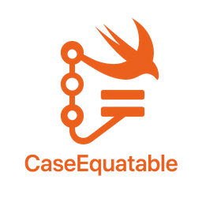

# CaseEquatable



`@CaseEquatable` is a Swift macro that automatically generates a “raw” case-only enumeration and makes your enum conform to `CaseEquatable`. This allows you to compare only the case names—ignoring any associated values.

## Features

* **Automatic `RawCase` Generation**: Synthesizes a nested `RawCase` enum without associated values.
* **Case-Only Comparison**: Conformance to `CaseEquatable` enables `==` between your enum and its `RawCase`.
* **Supports Associated Values**: Works on enums with or without associated values.

## Requirements

* Swift 5.9 or later (macros support)
* Xcode 15 or later

## Installation

Add the package to your `Package.swift`:

```swift
dependencies: [
    .package(url: "https://github.com/yourusername/CaseEquatable.git", from: "1.0.0"),
],
targets: [
    .target(
        name: "YourApp",
        dependencies: [
            .product(name: "CaseEquatableMacros", package: "CaseEquatable"),
        ]
    ),
]
```

## Usage

Annotate your enum with `@CaseEquatable`:

```swift
import CaseEquatableMacros

@CaseEquatable
enum NetworkResult: Equatable {
    case success(data: Data, statusCode: Int)
    case failure(error: Error)
    case cancelled
}

let result: NetworkResult = .success(data: ..., statusCode: 200)

// Compare only the case name:
if result == .success {
    print("Operation succeeded, regardless of payload.")
}
```

### Manual Expansion

The macro generates code equivalent to:

```swift
extension NetworkResult: CaseEquatable {
    enum RawCase {
        case success
        case failure
```
